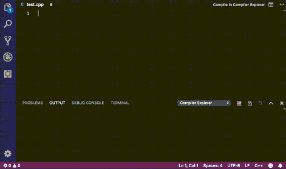

# Compiler Explorer for VSCode

This project is Alpha, but the most important feature is alredy available: you can see the assembly output of the compilation of a CPP file.

## Features

Currently, when you open a CPP file, a button appear at the editor's top right corner. That button triggers a compile using [Compiler Explorer at godbolt.org](https://godbolt.org), opening the result in a side editor and showing errors in the "Output" tab. After opening the tab, it automatically updates the compiled code as you type.

> Note: This extension does not provide C++ support or ASM syntax highlighting, and it won't do it, since there are better extensions out there to do this job.

It supports, via settings:

* Use a different endpoint (ex: a local instance)
* Change the compiler
* Set compiler flags

## Requirements

You need extra extensions for dealing with C++ and Assembly files.

## Known Issues

This is the bare minimal to prove it can work, so there's a lot of room for improvement:

* Select filters (ex: Intel, demangle, etc)
* Setup the interval for compile-on-edit
* Use CodeLens as an alternative to the side panel
* Automatically highlight asm/c++ depending on the cursor on the opposite panel

These are available via settings, requiring a UI to be more productive:

* Select the compiler
* Change the compiler flags
* Defining the endpoint (ex: if you want to use a local instance)

Some features would be more than desired, but they are probably not easy to achieve:

* Embed a local instance
* Integrate with the Microsoft's C++ extension to allow sending a pre-compiled copy of a file

## Release Notes

### 0.0.1

Public release of the code.